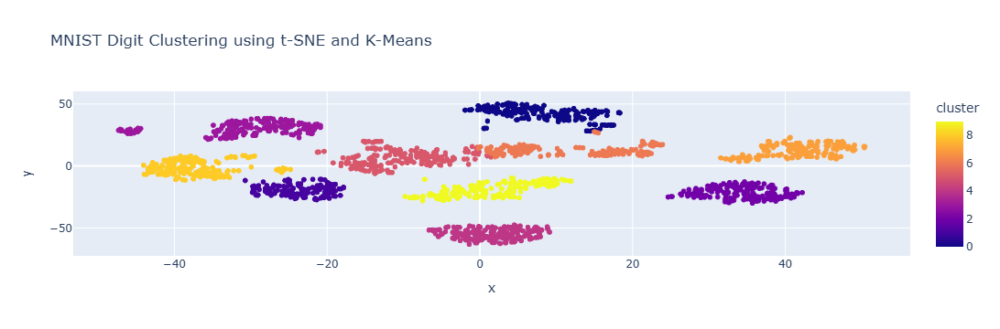

# MNIST Digit Clustering using t-SNE and K-Means

## 📌 Project Overview
This project demonstrates how handwritten digit images can be grouped based on visual similarity using unsupervised machine learning techniques.

We use:
- **MNIST Digits dataset** from `sklearn.datasets.load_digits()` (1,797 samples)
- **t-SNE** for dimensionality reduction
- **K-Means** for clustering
- **Plotly** for interactive visualization

---

## 📸 Sample Output

Below is a sample visualization showing the 2D t-SNE clustering of handwritten digits:




## 🧠 How the Project Works (Simple Explanation)
1. Each digit image is converted into numerical pixel values.
2. These high-dimensional values are reduced to **2D** using **t-SNE**.
3. Similar-looking digits are placed closer together in 2D space.
4. **K-Means** groups these points into clusters.
5. The result is shown as an **interactive 2D scatter plot**, where:
   - Each dot = one digit image
   - Colors = clusters
   - Hover shows digit label and cluster

---

## 📊 Output
- 2D scatter plot (not 3D)
- Clear cluster separation
- Interactive hover functionality
- Visual grouping of similar digits

---

## 🛠 Technologies Used
- Python
- scikit-learn
- matplotlib
- plotly
- pandas
- Jupyter Notebook

---

## ▶️ How to Run
1. Clone this repository
2. Install dependencies:
   ```bash
   pip install -r requirements.txt
